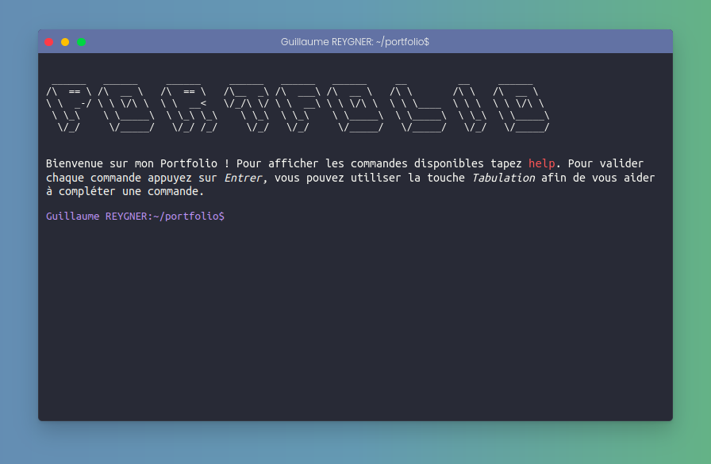

<h1 align="center">
   
  
   
Portfolio Terminal 
</h1>
<h4 align="center">Présentation de mon portfolio sous forme de terminal. Les commandes d'un vrai terminal sont utilisables sur le site néanmoins si vous ne maitrisez pas ces dernières vous serez facilement guider pour vous déplacer.</h4>
 

## WEB version 🌐

Le site est en live ici 👉 [portfolio](https://www.guillaumereygner.cf/)

## Technologies utilisées ⚙️

Pour ce programme les technologies suivantes ont été utilisé :  

 
 
Le site est responsive. Bonne découverte !

## Crédit 🔗
[Guillaume Reygner](https://github.com/guillaume-rygn)